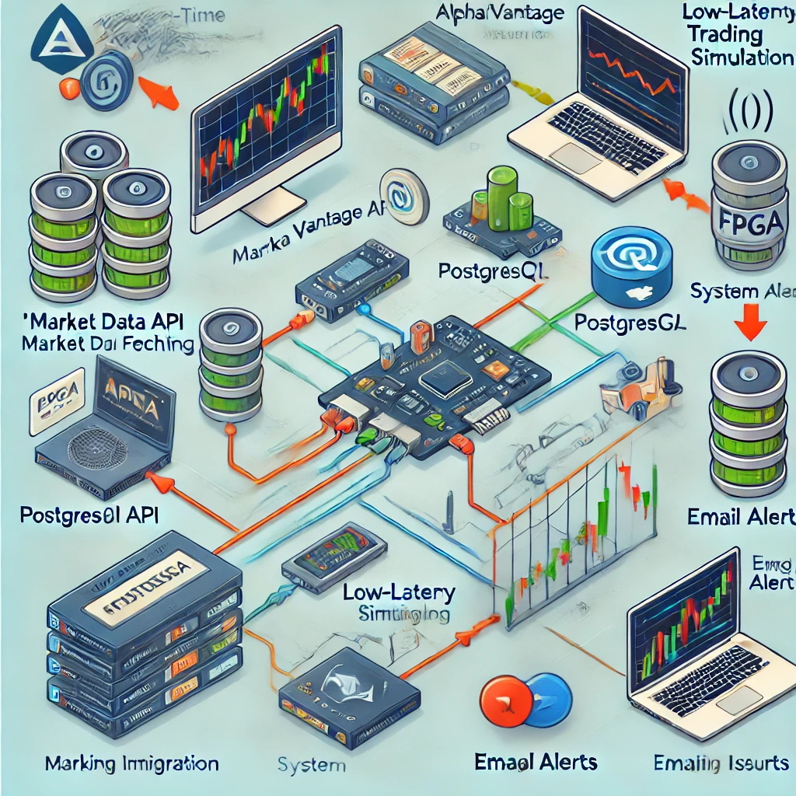

# Market Data API Integration and Monitoring System with FPGA Simulation

## Overview

This project integrates real-time market data fetching from the Alpha Vantage API, PostgreSQL storage, system monitoring, and an FPGA trading simulation. It provides a full solution for retrieving financial data, monitoring API status, and simulating a low-latency trading environment using FPGA configuration.

## Features

- **Market Data API Integration**: Fetches real-time stock market data using the Alpha Vantage API.
- **PostgreSQL Storage**: Stores market data in a PostgreSQL database.
- **System Monitoring**: Monitors the API response times and system health.
- **Email Alerts**: Sends email alerts if API issues or network failures are detected.
- **FPGA Simulation**: Simulates FPGA configuration and low-latency trading.



## Prerequisites

Before setting up the project, make sure you have the following:

- **Python 3.11+**: [Download and install Python](https://www.python.org/downloads/)
- **PostgreSQL**: [Download and install PostgreSQL](https://www.postgresql.org/download/)
- **Alpha Vantage API Key**: Get a free API key from [Alpha Vantage](https://www.alphavantage.co/support/#api-key).
- **Gmail App Password**: Generate an App Password for email alerts [here](https://support.google.com/accounts/answer/185833?hl=en).

## Setup Instructions

1. **Clone the Repository**

    ```bash
    git clone https://github.com/JUnelus/Market-Data-API-Integration-and-Monitoring-System-with-FPGA.git
    ```

2. **Set Up a Virtual Environment (Optional but recommended)**

    ```bash
    python3 -m venv venv
    source venv/bin/activate  # On Windows: venv\Scripts\activate
    ```

3. **Install Required Packages**

    ```bash
    pip install -r requirements.txt
    ```

4. **Set Up PostgreSQL Database**

    Create the `market_data` database in PostgreSQL. You can use the provided `database_setup.py` script:

    ```bash
    python database_setup.py
    ```

5. **Create the `.env` File**

    Create a `.env` file with your credentials and API key:

    ```bash
    # PostgreSQL settings
    POSTGRES_HOST=localhost
    POSTGRES_USER=your_username
    POSTGRES_PASSWORD=your_password

    # Alpha Vantage API
    ALPHA_VANTAGE_API_KEY=your_alpha_vantage_api_key

    # Email settings for alerts
    EMAIL_HOST=smtp.gmail.com
    EMAIL_PORT=587
    EMAIL_USER=your_email@gmail.com
    EMAIL_PASSWORD=your_app_password
    ALERT_EMAIL_TO=recipient_email@example.com
    ```

6. **Run the Main Script**

    Fetch and store market data, configure FPGA, and simulate trading by running:

    ```bash
    python api_integration/main.py
    ```

## Project Components

### 1. `api_integration/main.py`
Fetches real-time stock data from the Alpha Vantage API and stores it in PostgreSQL.

### 2. `monitoring/alert.py`
Sends email alerts for API failures or connectivity issues.

### 3. `simulation/fpga_config.py`
Simulates FPGA configuration and low-latency trading.

### 4. `monitoring/config_verifier.py`
Verifies that all necessary environment variables are properly set.

### 5. `monitoring/check_auth.py`
Verifies that the Alpha Vantage API key is valid.

### 6. `monitoring/network_diagnostics.py`
Performs network diagnostics, including pinging the Alpha Vantage server and running a traceroute.